# System Design and Flow Charts

هذا الملف يشرح مشروع Life OS Mega من زاوية هندسية: ما هي الطبقات، كيف تنتقل البيانات، أين تتم الحماية، وكيف تعمل أهم التدفقات داخل التطبيق.

## 1. فكرة النظام

Life OS Mega هو تطبيق ويب عربي PWA لإدارة الحياة الشخصية. في النسخة الحالية مضبوط للاستخدام الشخصي بحساب واحد فقط. صلاحية `admin` تستخدم داخليًا لفتح صفحات صيانة النظام، وليست لإدارة موظفين.

النظام يتكون من:

- واجهة Next.js App Router داخل `app/`
- مكونات UI مشتركة داخل `components/`
- منطق قراءة البيانات داخل `lib/data.ts` و `lib/mega/data.ts`
- منطق الكتابة والتعديل داخل `app/actions.ts`
- Supabase Auth للمصادقة
- Supabase Postgres لتخزين البيانات
- Row Level Security لعزل البيانات حسب المستخدم
- PWA Manifest وService Worker للتثبيت والعمل الأساسي بدون اتصال

## 2. High Level Architecture

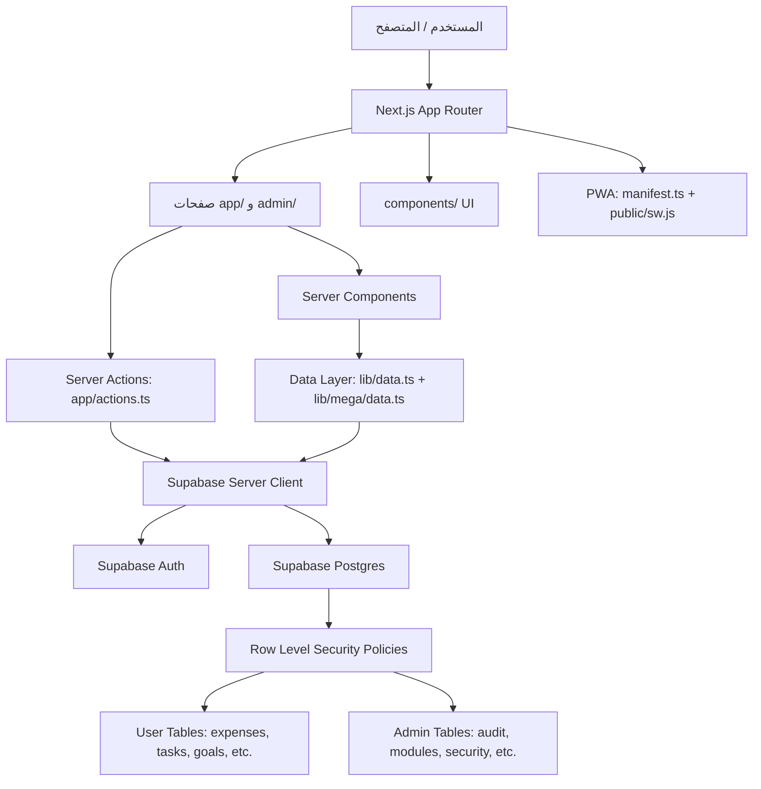

## 3. أهم الملفات ومسؤولية كل طبقة

| الطبقة | الملفات | المسؤولية |
|---|---|---|
| Routing | `app/` | صفحات الدخول، التطبيق، الأدمن، API routes |
| Layout | `app/app/layout.tsx`, `app/admin/layout.tsx` | حماية الصفحات وتغليفها بـ AppShell |
| UI | `components/` | القوائم، البطاقات، النماذج، الأيقونات |
| Generic Modules | `lib/mega/module-registry.ts`, `components/mega/module-page.tsx` | تعريف الوحدات وتوليد صفحة CRUD عامة |
| Reads | `lib/data.ts`, `lib/mega/data.ts` | جلب بيانات الداشبورد والوحدات |
| Writes | `app/actions.ts` | تسجيل الدخول، إنشاء السجلات، حذفها، تحديث الملف الشخصي |
| Auth Session | `proxy.ts`, `lib/supabase/session.ts` | تحديث جلسة Supabase وحماية المسارات |
| Supabase Client | `lib/supabase/server.ts`, `client.ts`, `config.ts` | إنشاء عميل Supabase للـ server/client |
| Database | `database/schema.sql`, `database/mega-extension.sql` | الجداول، العلاقات، triggers، RLS |
| Seed | `database/create-demo-auth-users.sql`, `realistic-demo-seed.sql` | إنشاء حساب وتجهيز بيانات Demo |

## 4. Authentication Flow

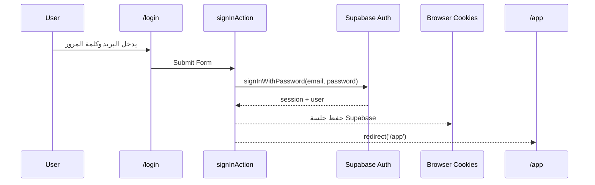

## 5. Route Protection Flow

`proxy.ts` يستدعي `updateSession()` من `lib/supabase/session.ts`.

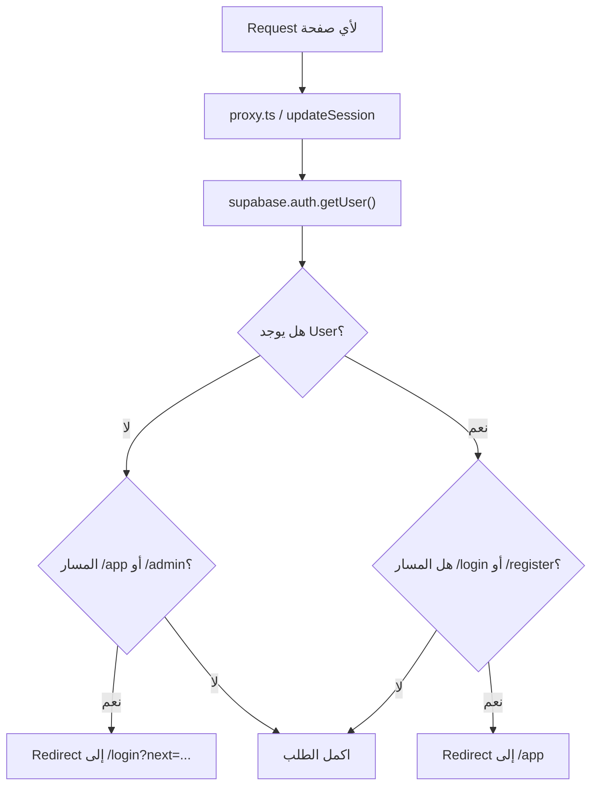

## 6. App Page Load Flow

عند فتح `/app` أو أي صفحة داخل التطبيق:

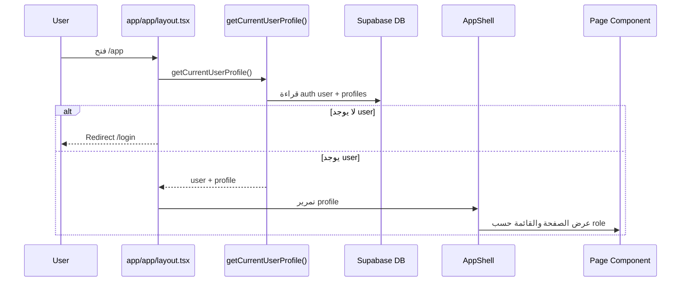

## 7. Dashboard Data Flow

الداشبورد يقرأ عدة جداول بالتوازي ثم يحسب الملخص.

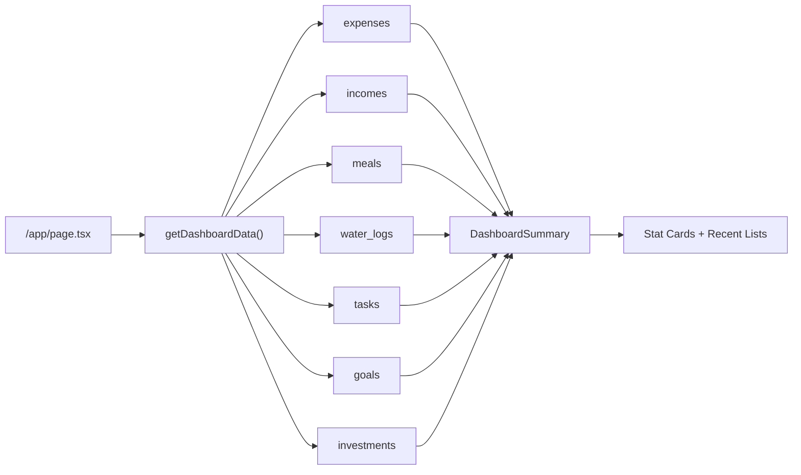

## 8. Generic Module Flow

معظم صفحات الوحدات المتقدمة تعمل بنفس القالب:

- تعريف الوحدة في `lib/mega/module-registry.ts`
- صفحة الوحدة تستدعي `MegaModulePage`
- `MegaModulePage` يقرأ config ويولد النموذج والقائمة
- الإضافة تتم عبر `createGenericRecordAction`
- الحذف يتم عبر `deleteGenericRecordAction`

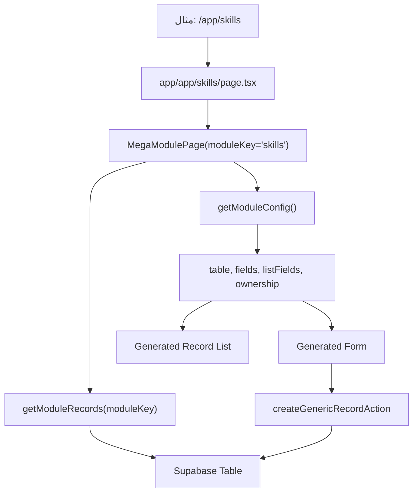

## 9. Create Record Flow

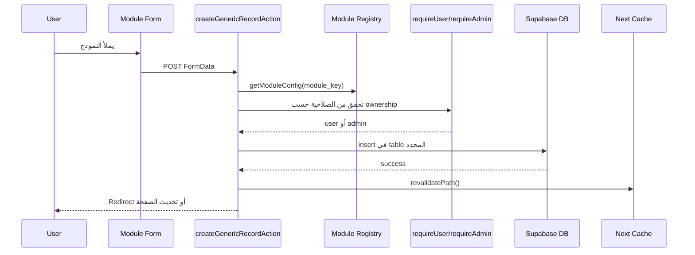

## 10. Personal System Management Flow

إدارة النظام ليست تطبيقًا منفصلًا. هي نفس النظام لكن الصفحات تحت `/admin` تحتاج `profile.role = admin`. في الاستخدام الشخصي هذا يعني أن حسابك الواحد يستطيع فتح صفحات الصيانة مثل الأمان والنسخ وجودة البيانات.

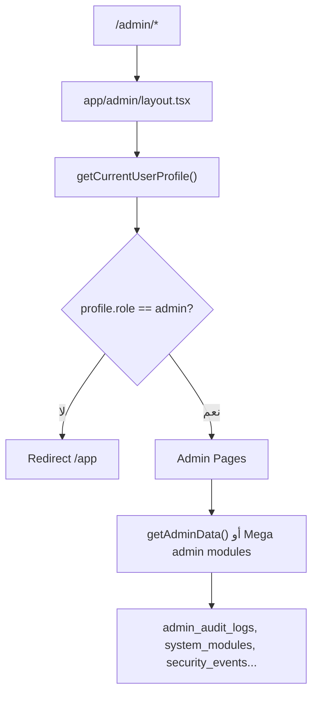

## 11. Database Design

### Core User Tables

كل جدول شخصي تقريبًا يحتوي:

- `id`
- `user_id`
- حقول خاصة بالموديول
- `created_at`
- `updated_at`

أمثلة:

- المال: `accounts`, `categories`, `expenses`, `incomes`, `budgets`, `subscriptions`
- الصحة: `meals`, `weight_logs`, `water_logs`, `workouts`, `sleep_logs`
- التعلم: `courses`, `course_lessons`, `books`, `reading_logs`, `skills`
- الإنتاجية: `tasks`, `goals`, `habits`, `daily_plans`, `time_blocks`
- الحياة الشخصية: `journal_entries`, `people`, `travel_plans`, `documents`, `idea_bank`

### Admin Tables

جداول إدارية لا تعتمد على `user_id` غالبًا، وتتحكم بها سياسة `public.is_admin()`:

- `admin_audit_logs`
- `system_modules`
- `data_quality_checks`
- `module_templates`
- `backup_jobs`
- `security_events`
- `system_announcements`

## 12. RLS Security Model

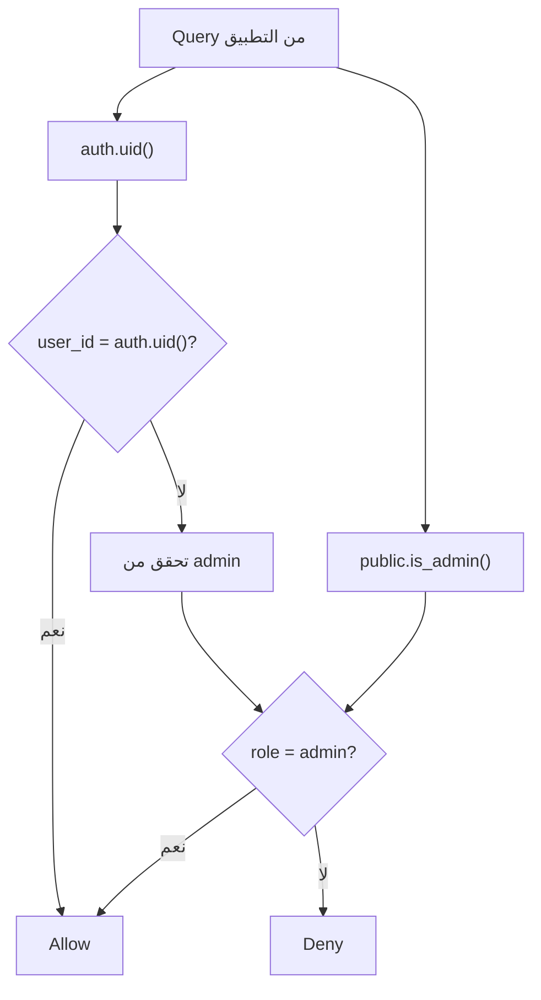

قاعدة الجداول الشخصية:

```sql
user_id = auth.uid() or public.is_admin()
```

قاعدة الجداول الإدارية:

```sql
public.is_admin()
```

## 13. PWA Flow

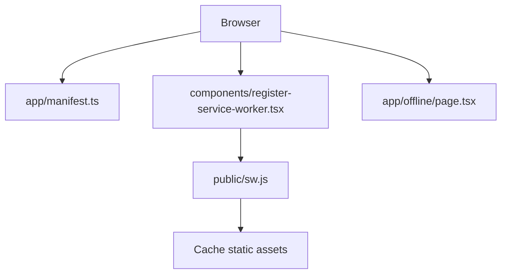

## 14. Data Seeding Flow

للاستخدام الشخصي الحالي:

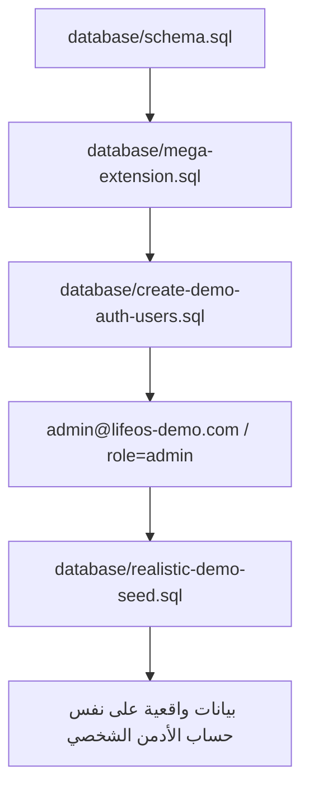

## 15. Mental Model سريع

فكر في النظام بهذا الشكل:

1. المستخدم يدخل من `/login`
2. Supabase Auth يحفظ الجلسة في cookies
3. `proxy.ts` يحمي المسارات
4. صفحات `/app` تقرأ `profile`
5. كل صفحة تقرأ بياناتها من Supabase
6. كل نموذج يرسل إلى Server Action
7. Server Action يتحقق من المستخدم ثم يكتب في قاعدة البيانات
8. RLS في Supabase هو خط الدفاع الأخير
9. حسابك الشخصي يرى صفحات الصيانة لأن `profile.role = admin`

## 16. أهم قرار تصميمي

المشروع ليس CRUD صفحات منفصلة فقط. الجزء الأهم هو `module-registry`:

- يعرّف الجدول
- يعرّف الحقول
- يعرّف طريقة العرض
- يحدد هل الوحدة للمستخدم أم للأدمن

لذلك إضافة وحدة جديدة غالبًا تحتاج:

1. إنشاء جدول في SQL
2. إضافة config في `lib/mega/module-registry.ts`
3. إضافة route بسيط يستدعي `MegaModulePage`
4. إضافة رابط في navigation إذا لزم
